# Digital NFT Marketplace
#### NFT marketplace where users mint ERC721 implemented Digital designs NFTs and manage them on the Ethereum Blockchain.
#

### Stack
- [Solidity](https://docs.soliditylang.org/en/v0.7.6/) - Object-oriented, high-level language for implementing smart contracts.
- [Bootstrap 4](https://getbootstrap.com/) - CSS framework for faster and easier web development.
- [React.js](https://reactjs.org/) - JavaScript library for building user interfaces.
- [web3.js](https://web3js.readthedocs.io/en/v1.3.4/) - Allows users to interact with a local or remote ethereum node using HTTP, IPC or WebSocket.
- [Truffle](https://www.trufflesuite.com/truffle) - Development environment, testing framework and asset pipeline for blockchains using the Ethereum Virtual Machine (EVM).
- [Ganache](https://www.trufflesuite.com/ganache) - Personal blockchain for Ethereum development used to deploy contracts, develop DApps, and run tests.
#
<!-- ### Interact with the deployed DApp
#### Crypto Boy Marketplace DApp requires [Metamask](https://metamask.io/) browser wallet extension to interact with.
#### Connect metamask browser wallet to Kovan Test Network.
#### Request and get test etheres for the metamask account from [Kovan Faucet](https://gitter.im/kovan-testnet/faucet) to make transactions.
#### Crypto Boy Marketplace Smart Contract is deployed to Kovan Testnet - [0x420d2a6E87D87992EB01e5BFe762B3F437dBfD85](https://kovan.etherscan.io/address/0x420d2a6e87d87992eb01e5bfe762b3f437dbfd85)
#### Access Crypto Boy Marketplace DApp at [cryptoboys-NFT-marketplace](https://devpavan04.github.io/cryptoboys-nft-marketplace/) and start minting your Crypto Boys.
# -->
### Run the DApp Locally

#### Open new terminal window and clone this repository
```
git clone https://github.com/BridgeX-Blockchain/varun_mehta.git
```

#### Install truffle
```
npm install -g truffle
```
#### Install ganache-cli
```
npm i ganache-cli
```
#### Run ganache-cli
```
ganache-cli --port 7545 --quiet
```
#### Install dependencies
```
npm install
```
#### Compile smart contract
```
truffle compile
```
#### Deploy smart contract to ganache
```
truffle migrate
```
#### Test smart contract
```
truffle test
```
#### Start DApp
```
npm start
```
#### Open metamask browser wallet and connect network to Localhost 7545.
#### Import accounts from ganache-cli into the metamask browser wallet to make transactions on the DApp.

### Screenshots
-Create Profile
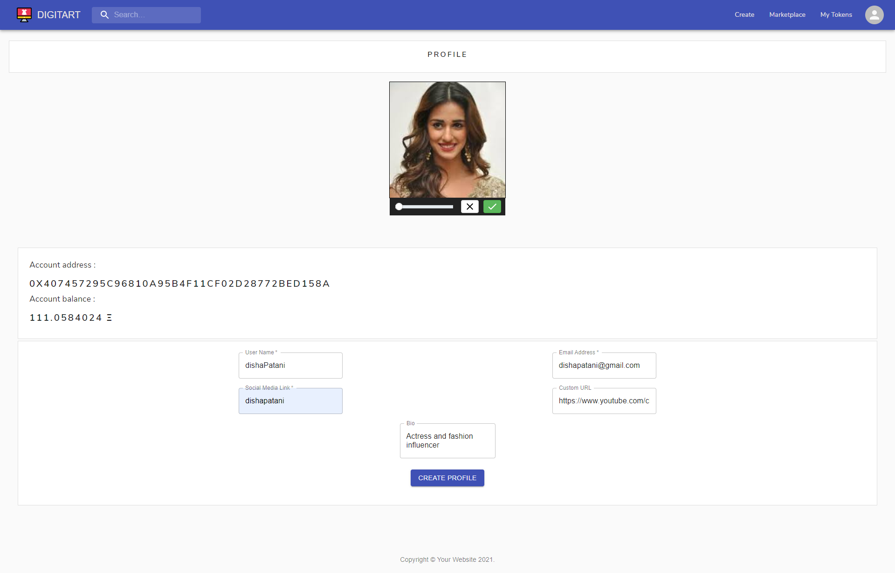
-View account Details
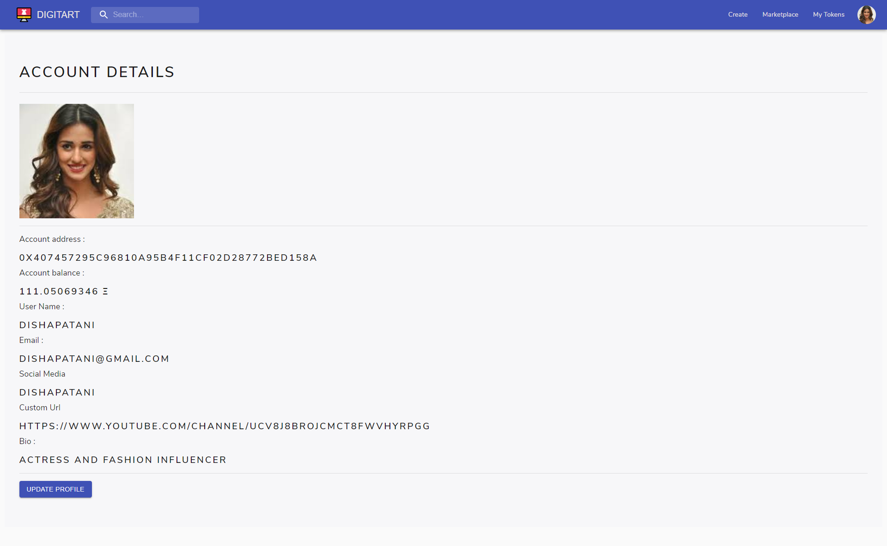
-Update Profile
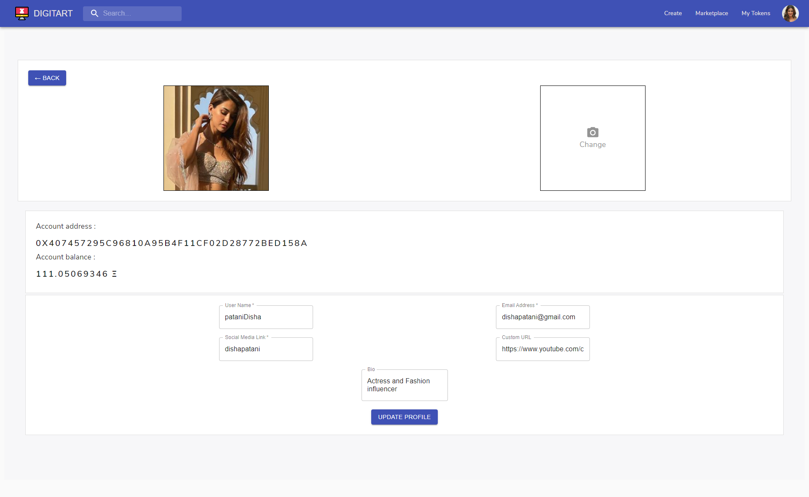
-Details Changed
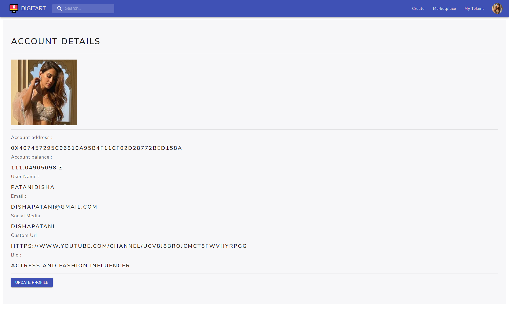
-Create a design
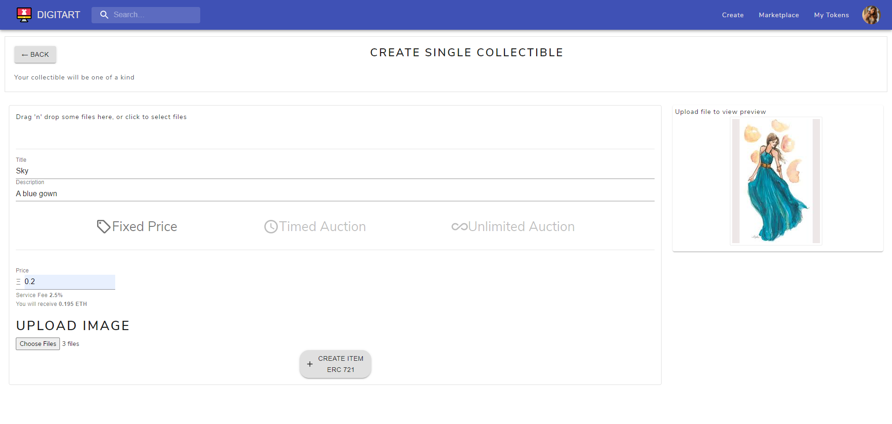
-View created design on our marketplace
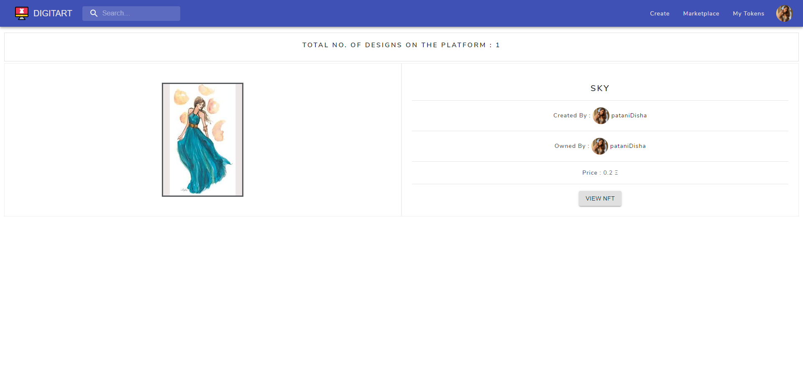
-View all details of the design

-Change Price
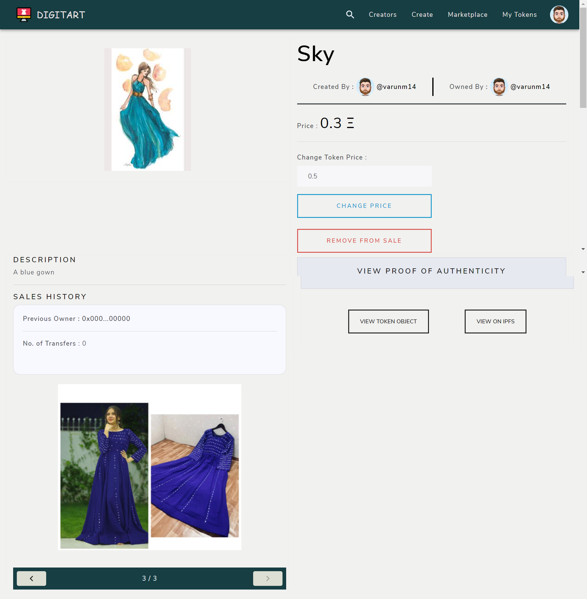
-Price changed

-Swap account and create new design
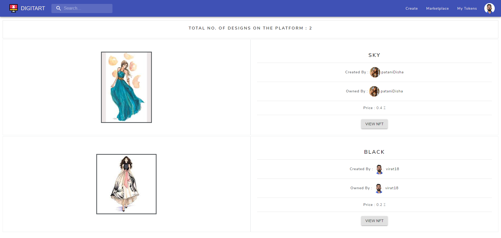
-Removed from sale
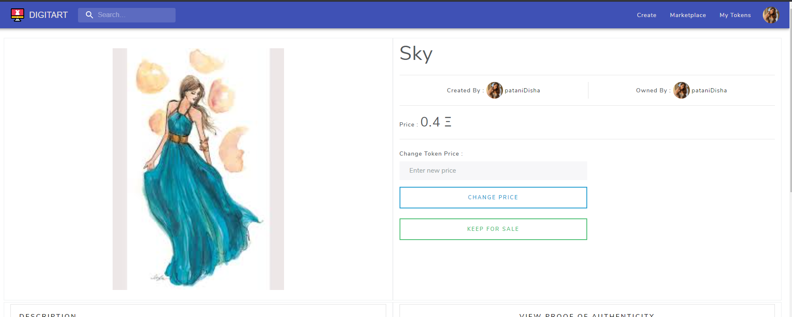
-Not for sale
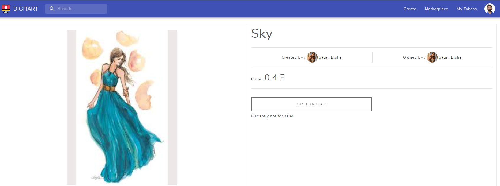
-Bought by other account
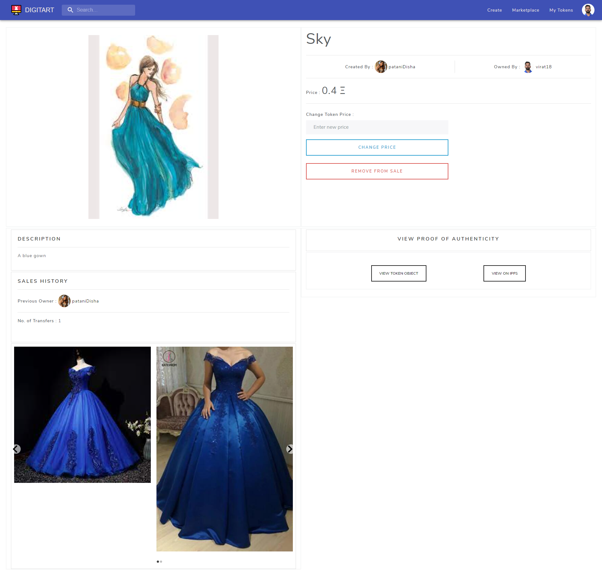
-My collection
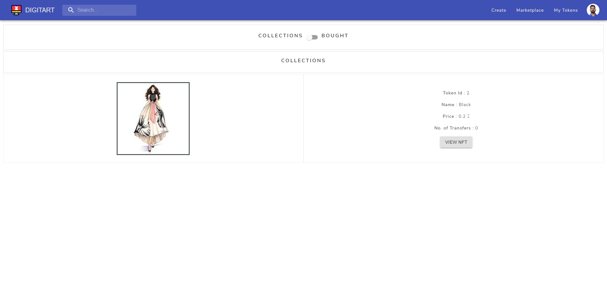
-My bought
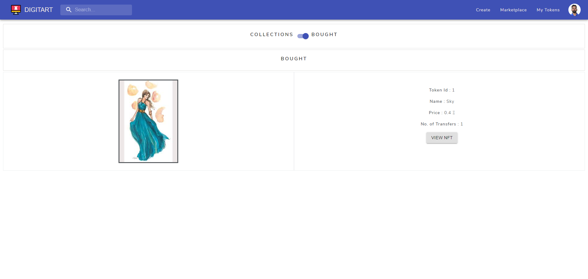
-Marketplace
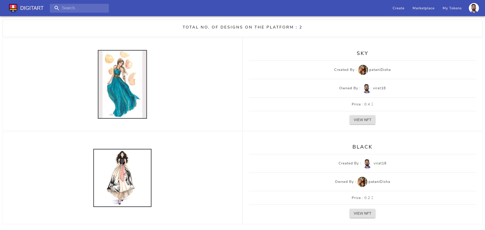
-View others account and their collection
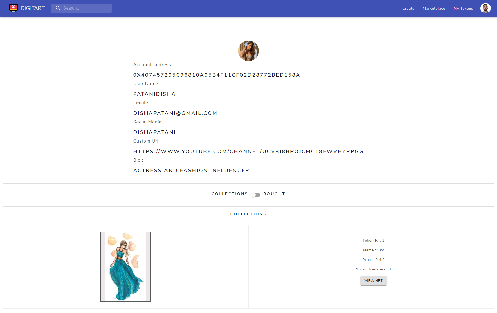
-View others account and their bought
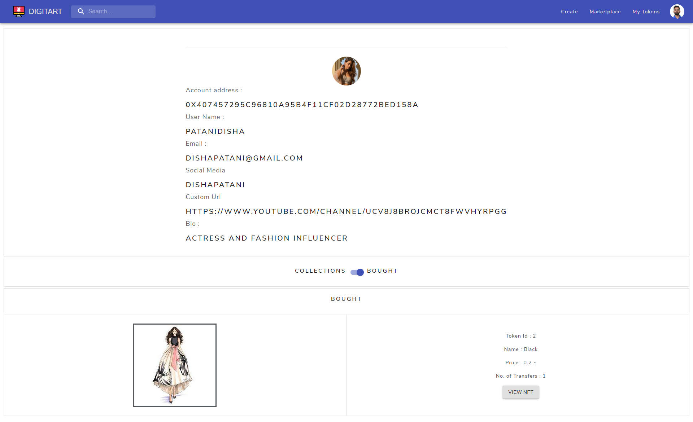
