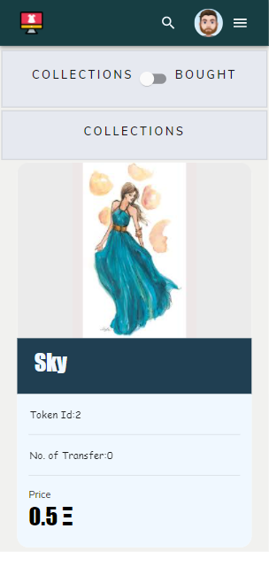

# Digital NFT Marketplace
#### NFT marketplace where users mint ERC721 implemented Digital designs NFTs and manage them on the Ethereum Blockchain.
#
###Structure
```

├── migrations/                -> Contains Migrations for Smart Contracts
├── public/
├── screenshots/
├── src
|   ├── abis/
|   ├── components/            -> Contains Frontend React pages
|   ├── contracts/             -> Conatains Smart Contracts
|   └── index.js
├── test/                      -> Contains Chai and Mocha tests for Smart Contracts
├── package.json               -> Npm package.json file
└── truffle-config.js          -> Configuration file for truffle

```
### Stack
- [Solidity](https://docs.soliditylang.org/en/v0.7.6/) - Object-oriented, high-level language for implementing smart contracts.
- [Bootstrap 4](https://getbootstrap.com/) - CSS framework for faster and easier web development.
- [React.js](https://reactjs.org/) - JavaScript library for building user interfaces.
- [web3.js](https://web3js.readthedocs.io/en/v1.3.4/) - Allows users to interact with a local or remote ethereum node using HTTP, IPC or WebSocket.
- [Truffle](https://www.trufflesuite.com/truffle) - Development environment, testing framework and asset pipeline for blockchains using the Ethereum Virtual Machine (EVM).
- [Ganache](https://www.trufflesuite.com/ganache) - Personal blockchain for Ethereum development used to deploy contracts, develop DApps, and run tests.
#
<!-- ### Interact with the deployed DApp
#### Crypto Boy Marketplace DApp requires [Metamask](https://metamask.io/) browser wallet extension to interact with.
#### Connect metamask browser wallet to Kovan Test Network.
#### Request and get test etheres for the metamask account from [Kovan Faucet](https://gitter.im/kovan-testnet/faucet) to make transactions.
#### Crypto Boy Marketplace Smart Contract is deployed to Kovan Testnet - [0x420d2a6E87D87992EB01e5BFe762B3F437dBfD85](https://kovan.etherscan.io/address/0x420d2a6e87d87992eb01e5bfe762b3f437dbfd85)
#### Access Crypto Boy Marketplace DApp at [cryptoboys-NFT-marketplace](https://devpavan04.github.io/cryptoboys-nft-marketplace/) and start minting your Crypto Boys.
# -->
### Run the DApp Locally

#### Open new terminal window and clone this repository
```
git clone https://github.com/BridgeX-Blockchain/varun_mehta.git
```

#### Install truffle
```
npm install -g truffle
```
#### Install ganache-cli
```
npm i ganache-cli
```
#### Run ganache-cli
```
ganache-cli --port 7545 --quiet
```
#### Install dependencies
```
npm install
```
#### Compile smart contract
```
truffle compile
```
#### Deploy smart contract to ganache
```
truffle migrate
```
#### Test smart contract
```
truffle test
```
#### Start DApp
```
npm start
```
#### Open metamask browser wallet and connect network to Localhost 7545.
#### Import accounts from ganache-cli into the metamask browser wallet to make transactions on the DApp.

### Screenshots
-Create Profile

-View account Details

-View Your Details in all Creators

-Update Profile

-Create a design

-View created design on our marketplace

-View all details of the design

-Change Price

-Price changed

-Swap account and view your design from other's view

-Removed from sale

-Not for sale

-Bought by other account

-Owner Details Changed

-My Collections

-My Bought

-Create one more account and design

-Load more data on clicking

-All Designs

-Load more creators on clicking

-All Creators

-Search field based on user name and design name

-View other account details and their collections

-View other's collections

-Responsive all creations

-responsive all creators

-Responsive all links

-Responsive Create

-Responsive Account Details

-Responsive Update Profile

-Responsive Design Details

-Responsive My Token Details

-Responsive my Collections

-Responsive my Bought

-Responsive Search

-Responsive view other accounts collection and bought


